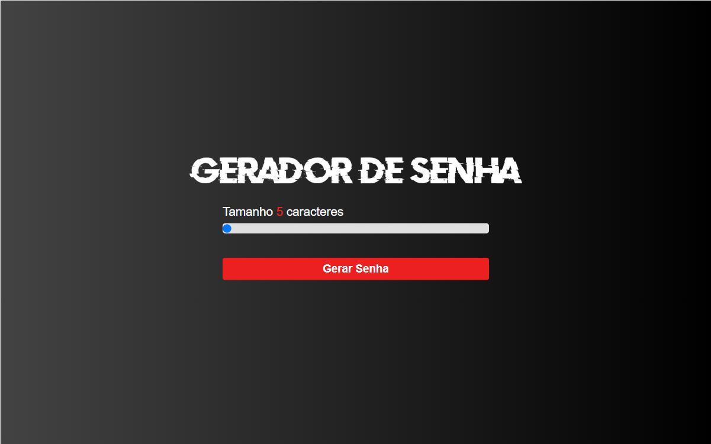
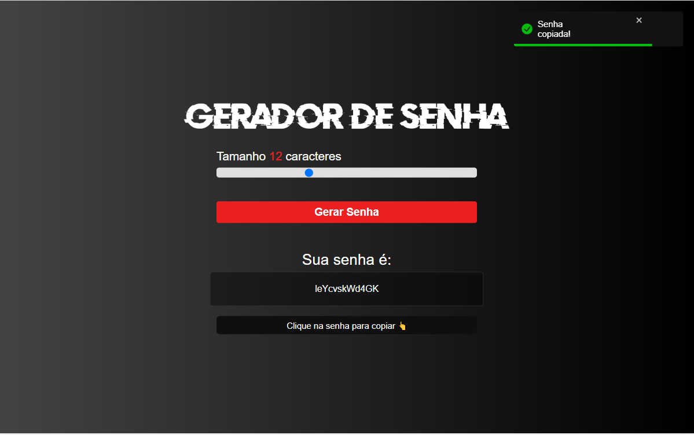

<div align="center">
  <h1>Gerador de Senhas</h1>
</div>

<div align="center">
  
  
</div>

Aplicação para geração de senhas.

## ✔️ Técnicas e tecnologias utilizadas

Lista de tecnologias que foram usadas nesse projeto:


## 🛠️ Abrir e rodar o projeto

Para abrir e rodar o projeto, entre na pasta do frontend execute ```npm install``` para instalar as dependências e ```npm run dev``` para iniciar o projeto.

Depois, acesse <a href="http://localhost:5173/">http://localhost:5173/</a> no seu navegador.

### Projeto em produção
Este projeto pode ser visualizado neste [link](https://gerador-senha-mocha.vercel.app/).

## 📚 Mais informações

Entre em contato pelo [linkedin](https://www.linkedin.com/in/grazziano-fagundes/).

<div align="center">
  <small>Grazziano Borges Fagundes - 2023</small>
</div>